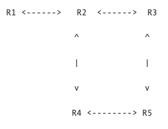

# Forwarding basico

## Conceptos importantes

* **Capa de red:** Para simular un mini-Internet necesitaremos simular el comportamiento de la capa de red. Esto significa que, a diferencia de capas superiores, aquí ya no asumimos que los datos simplemente llegan de un punto A a un punto B de forma directa, sino que estos pasan por routers intermedios.
* **Routers:** Los routers son equipos físicos que se encargan de re-dirigir datos entre las distintas redes que conforman el Internet.
* **Round-robin:** Round-robin es un algoritmo de scheduling de procesos. En round-robin se ordenan los procesos en una lista circular y se van ejecutando en orden. Esto es equivalente a ordenar los procesos en una lista común, ejecutarlos en orden, y luego de ejecutar último elemento de la lista se vuelve a comenzar desde el inicio de la lista. En el contexto de esta actividad usaremos round-robin para visitar elementos de un conjunto siguiendo el algoritmo de round-robin.
* **Comando `netcat`:** El comando netcat nos permite enviar mensajes por la red. Para ello debemos entregarle la dirección IP y puerto a la que queremos llegar. Para que los mensajes sean enviados de forma 'no orientada a conexión' usamos la opción -u. El formato de uso es:

    ```bash
    $ nc [opciones] [IP] [puerto] << EOF
    ((mensaje))
    EOF
    ```

* **Time-To-Live (TTL):** El Time-To-Live o tiempo de vida se refiere a la cantidad de *saltos* o *hops* que puede dar un paquete IP antes de ser descartado por la red. De esta forma el TTL de un paquete se disminuye en 1 cada vez que el paquete pasa por un router (es decir, cada vez que da un salto). Si un router recibe un paquete con TTL = 0 entonces los descarta y no lo vuelve a forwardear (y "se muere" :c, por eso se llama tiempo de vida). El TTL se usa para evitar que paquetes perdidos se queden para siempre dando vueltas por la red causando congestión.

    Lamentablemente este campo no tiene un valor estandar, y puede variar mucho de un sistema operativo a otro:
  * nix (Linux/Unix): 64
  * Windows: 128
  * Solaris/AIX: 254

## Actividad

Usando como guía la estructura de mini-Internet de la sección [Simulando un mini-Internet](/ejemplos_por_materia/redes_y_ruteo/resumen.md), en esta actividad vamos a simular nuestro propio mini-Internet usando sockets UDP o no orientados a conexión. En esta actividad vamos a comenzar creando nuestro mini-Internet sin considerar TTL y luego vamos a considerar que sí hay TTL.

Los pasos a seguir para crear nuestros routers son:

### Mini-internet sin TTL

Cree el código que va a necesitar para manejar sus routers usando la sección anterior [Simulando un mini-Internet](/ejemplos_por_materia/redes_y_ruteo/resumen.md) como guía. Para crear sus routers siga los siguientes pasos:

1. Cree un código que reciba como parámetros la IP y puerto donde va a estar escuchando el router, y el nombre del archivo que contiene su tabla de rutas. Para ello haga que su código reciba estos parámetros como argumentos usando sys.argv de la siguiente manera:

    ```bash
    $ python3 router.py router_IP router_puerto router_rutas.txt
    ```

    Con esto si queremos echar a corer R1 y R2 como se describe en [Simulando un mini-Internet](/ejemplos_por_materia/redes_y_ruteo/resumen.md) tendriamos que abrir 2 terminales y ejecutar:

    ```bash
    $ # Router R1
    $ python3 router.py 127.0.0.1 8881 rutas_R1_v1.txt
    ```

    ```bash
    $ # Router R2
    $ python3 router.py 127.0.0.1 8882 rutas_R2_v1.txt
    ```

    **Test**: Verifique que su código obtiene correctamente los parámetros. Ejecute 2 instancias de su código router en terminales distintas.

2. Dentro de su código haga un socket no orientado a conexión que escuche de forma bloqueante en el par `(router_IP, router_puerto)` que recibió como parámetros.
3. Considerando la estructura de paquete IP que se provee en la sección Simulando un mini-Internet, haga la función `parse_packet(IP_packet)` que le permita extraer los headers y datos del paquete recibido, y lo pase a una estructura de datos conveniente. Aquí `IP_packet` corresponde al paquete en bytes que se recibe a través del socket. Además cree la función `create_packet(parsed_IP_packet)` que recibe la estructura de datos conveniente `parsed_IP_packet` que retorna la función `parse_packet` y crea un paquete IP de acuerdo a la estructura provista en la sección Simulando un mini-Internet.

    **Test:** Verifique que puede entregarle un paquete IP en bytes a su función parse_packet y que lo que esta retorna puede volver a convertirse en un paquete IP usando la función create_packet. A continuación puede ver un ejemplo del test:

    ```python
    IP_packet_v1 = "127.0.0.1,8881,hola".encode()
    parsed_IP_packet = parse_packet(IP_packet_v1)
    IP_packet_v2_str = create_packet(parsed_IP_packet)
    IP_packet_v2 = IP_packet_v2_str.encode()
    print("IP_packet_v1 == IP_packet_v2 ? {}".format(IP_packet_v1 == IP_packet_v2))
    ```

4. Cree la función `check_routes(routes_file_name, destination_address)`, la cual se deberá encargar de revisar en orden la tabla de rutas para indicar la dirección del siguiente salto. Esta función recibe como parámetros el nombre del archivo que contiene las rutas `routes_file_name` y la dirección de destino `destination_address`. Esta función debe retornar el par `(next_hop_IP, next_hop_puerto)` que indica por dónde se debe enviar un paquete que se dirige a la dirección de destino `destination_address`. Si al recorrer la tabla de rutas no encuentra una ruta apropiada, la función deberá retornar `None`.

    **Test:** Pruebe su función `check_routes` usando como base distintos routers del ejemplo 2 mostrado en la sección [Simulando un mini-Internet](/ejemplos_por_materia/redes_y_ruteo/resumen.md). Pruebe con paquetes cuyo destino se encuentre dentro de la red y paquetes que se encuentren fuera (por ejemplo el paquete `127.0.0.1,8884,hola)`.

5. Haga que el código de su router pueda recibir paquetes en un loop. En caso de recibir un mensaje, haga que su router primero chequee si el paquete es para él. Si es para él, haga que este imprima el contenido del paquete (sin headers). Si el paquete no es para él, llame a la función que implementó en el paso 4 y use la dirección que esta retorna para hacer forward del paquete. Haga que su router imprima el mensaje "**redirigiendo paquete [`paquete_ip`] con destino final [`destination_address`] desde [`dirección_router_actual`] hacia [`dirección_next_hop`]**" donde [`dirección_next_hop`] es la dirección que obtuvo de la función que implementó en el paso 4. En caso de que su función retorne `None` simplemente ignore el paquete e imprima "**No hay rutas hacia [`destination_address`] para paquete [`paquete_ip`]**".

    **Test:** Pruebe su código usando las tablas de rutas provistas en la sección [Simulando un mini-Internet](/ejemplos_por_materia/redes_y_ruteo/resumen.md). Note que si usa las tablas de rutas del ejemplo 1 tendrá que echar a correr 2 routers, y si usa las tablas de rutas del ejemplo 2 tendrá que echar a correr 3 routers. Para poner a correr múltiples routers deberá usar múltiples ventanas/pestañas de la terminal pues cada ventana de terminal le permite correr un proceso pesado distinto. Luego de echar a correr sus routers, abra una nueva terminal y use `netcat` para probar sus routers.

6. Ahora probaremos nuestro mini-Internet con una estructura de 5 routers. Considere la siguiente estructura. Puede encontrar las tablas de ruta para este caso más abajo en la sección [Material e indicaciones para la actividad](#material-e-indicaciones-para-la-actividad).

    

7. Modifique la función implementada en paso 4 para manejar el caso en que hay más de una ruta posible para forwardear el paquete. Si hay más de una ruta posible debe alternar entre las rutas usando round-robin. Para lograrlo deberá implementar alguna forma de llevar la cuenta de las rutas que ya ha visitado. Puede hacer esto haciendo que su función modifique variables globales, usando clases, o entregándole a su función alguna estructura de datos para modificar. Importante: esta funcionalidad debe poder mantenerse para un número arbitrario de rutas posibles. Si el router tiene acceso a dos 'áreas de la red' tal que para cada área hay múltiples rutas, entonces su router deberá recordar cuál fue la última ruta que tomó en cada una de esas áreas.

    Para esta parte usted deberá tomar una **decisión de diseño** sobre su función, incluya una breve descripción en su informe sobre cómo maneja round-robin su código.

    **Test 1:** Verifique que al enviar varios paquetes a una misma dirección a través de un router, este va ciclando entre las posibles rutas. Para ello puede utilizar la estructura mostrada en el paso 6 y verificar que paquetes que van desde R1 a R5 toman distintos caminos cada vez que pasan por el router R2. Luego de implementar round-robin ¿Puede ocurrir que un paquete quede dando vueltas por su red? (no es necesario que responda esta pregunta en su informe)

    **Test 2:** Modifique la red mostrada en el paso 6 para que exista un router R0 que se conecta a R1 y R2 y un router R6 que se conecta con R2 y R3. Utilizando esta nueva estructura intercale el envío de múltiples paquetes que van desde R1 a R5 y desde R5 a R1. Verifique que round-robin en el router R2 cicla correctamente dentro de cada área de la red.

### Pruebas Mini-Internet sin TTL

1. Usando las rutas del ejemplo 2 de la sección anterior, pruebe qué ocurre si alguien configura mal una de las tablas de rutas y coméntelo brevemente en su informe. Para ello, cambie la configuración de la tabla de rutas del archivo rutas_R2_v2.txt  por:

    ```txt
    127.0.0.1 8881 8881 127.0.0.1 8881
    127.0.0.1 8883 8883 127.0.0.1 8881
    ```

2. Usando las rutas de la estructura del paso 6, pruebe su código enviando paquetes a R1 con destino R5 y vea que su función de rutas efectivamente usa round-robin, es decir que va alternando entre rutas. Haga varias pruebas ¿cuántos saltos dan los paquetes? ¿siempre dan la misma cantidad de saltos?¿cómo se compara la cantidad de saltos que dan los paquetes versus la cantidad de saltos mínima? Anote sus observaciones en el informe.

3. Repita las pruebas del punto 2 utilizando la estructura que se le pidió crear en el Test 2 del paso 7 y escriba sus observaciones en su informe. Añada en su informe los contenidos de los distintos archivos de rutas que debió crear.

## Mini Internet con TTL

En esta parte vamos a realizar modificaciones a nuestro mini-Internet para evitar la aparición de ciclos infinitos en el ruteo de los mensajes. Este tipo de ciclos puede ocurrir, por ejemplo, cuando la tabla de rutas de un router se encuentra mal configurada tal como probamos en la parte anterior. Para evitar ciclos infinitos modificaremos el header y agregaremos un tercer valor: el Time-To-Live o TTL . Nuestro TTL corresponderá a un número entre 1 y 255. Con esto el nuevo formato de mensaje será:

```bash
[Direccion IP],[Puerto],[TTL],[mensaje]
```

Para esta parte de la actividad, siga los siguientes pasos:

1. Modifique las funciones `parse_packet` y `create_packet` para que ahora puedan manejar el nuevo campo [TTL].

    **Test:** Verifique que puede entregarle un paquete IP en bytes a su funcion `parse_packet` y que lo que esta retorna puede volver a convertirse en un paquete IP usando la funcion `create_packet` cuando el paquete incluye al header TTL. A continuacion puede ver el test de la parte 1 modificado para contener TTL:

    ```python
    IP_packet_v1 = "127.0.0.1,8881,4,hola".encode()
    parsed_IP_packet = parse_packet(IP_packet_v1)
    IP_packet_v2_str = create_packet(parsed_IP_packet)
    IP_packet_v2 = IP_packet_v2_str.encode()
    print("IP_packet_v1 == IP_packet_v2 ? {}".format(IP_packet_v1 == IP_packet_v2))
    ```

2. Haga que su codigo procese el mensaje solo si **TTL > 0**. Si dicha condicion no se cumple, su codigo debera ignorar el paquete e imprimir el mensaje **"Se recibio paquete [paquete_ip] con TTL 0"**.
3. En caso de que el paquete deba ser reenviado, haga que su codigo drecremente el valor TTL antes de hacer forward. Es decir, que el TTL disminuya en 1 antes de hacer forward.

    **Test:** Ejecute algunas de las estructuras utilizadas en la parte 1 que contenga al menos 3 routers, envie el paquete `127.0.0.1,8883,1,hola`, desde R1 a R3 y verifique que este no logra llegar a destino pues se descarta por  TTL.

4. Para las pruebas haga un codigo que lea un archivo linea por linea, encapsule cada linea en headers IP y luego envie cada paquete a su direccion de destino usando un socket UDP. Haga que este codigo reciba los headers y la direccion del router inicial de destino como argumentos con **sys.argv** de la siguiente forma:

    ```bash
    $ python3 prueba_router.py headers IP_router_inicial puerto_router_inicial
    ```

    Con esto si queremos enviar linea a linea un archivo a traves de nuestro mini internet desde el router R1 al router R5, se debe ejecutar:

    ```bash
    $ python3 prueba_router.py 127.0.0.1,8885,10 127.0.0.1 8881
    ```

### Pruebas Mini-Internet con TTL

1. Repita la primera prueba de la parte 1 (donde indujo error en la tabla de rutas) y vea qué ocurre. Use un TTL inicial `TTL = 10` ¿Qué diferencias observa? Anote sus observaciones brevemente en su informe.

2. Cree un código que lea un archivo línea por línea, encapsule cada línea en headers IP y luego envíe cada paquete a un router usando un socket UDP. Haga que este código reciba los headers y la dirección del router inicial de destino como argumentos con sys.argv de la siguiente forma:

    ```bash
    $ python3 prueba_router.py headers IP_router_inicial puerto_router_inicial
    ```

    Con esto si queremos enviar línea a línea un archivo a través de nuestro mini-Internet desde el router R1 al router  R5, se debe ejecutar:

    ```bash
    python3 prueba_router.py 127.0.0.1,8885,10 127.0.0.1 8881
    ```

3. Considere la configuración de 5 routers vista en la parte 1. Use el código implementado en el paso 4 con un archivo grande (de varias líneas) ¿Qué ocurre con el orden de los paquetes? Anote sus observaciones en el informe.

## Material e indicaciones para la actividad

* **Tablas de rutas para caso 5 routers:** Dada la siguiente estructura:

    

    Las tablas de rutas seran:

    ```txt
    # archivo rutas_R1_v3.txt
  
    127.0.0.1 8882 8885 127.0.0.1 8882
    ```

    ```txt
    # archivo rutas_R2_v3.txt

    127.0.0.1 8881 8881 127.0.0.1 8881
    127.0.0.1 8883 8885 127.0.0.1 8883
    127.0.0.1 8883 8885 127.0.0.1 8884
    ```

    ```txt
    # archivo rutas_R3_v3.txt

    127.0.0.1 8881 8882 127.0.0.1 8882
    127.0.0.1 8881 8882 127.0.0.1 8885
    127.0.0.1 8884 8885 127.0.0.1 8882
    127.0.0.1 8884 8885 127.0.0.1 8885
    ```

    ```txt
    # archivo rutas_R4_v3.txt

    127.0.0.1 8881 8883 127.0.0.1 8882
    127.0.0.1 8881 8883 127.0.0.1 8885
    127.0.0.1 8885 8885 127.0.0.1 8885
    ```

    ```txt
    # archivo rutas_R5_v3.txt

    127.0.0.1 8881 8884 127.0.0.1 8884
    127.0.0.1 8881 8884 127.0.0.1 8883
    ```
