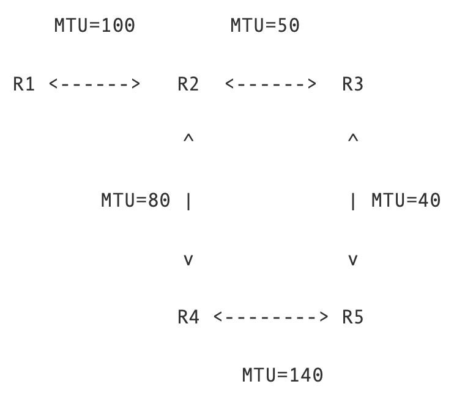
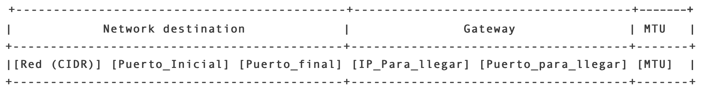

# Fragmentacion

## Antes de empezar

* **Maximum Transmission Unit (MTU)**: El MTU se refiere a la cantidad máxima de información en bytes que podemos enviar entre 2 routers a través del enlace que los une. Si un paquete IP es más grande que el MTU del enlace por el que debe pasar, este deberá ser fragmentado por el router en trozos más pequeños que quepan por el enlace. Estos trozos de datagrama IP son llamados fragmentos IP. Cada fragmento debe tener su propio header, por lo que la suma del tamaño del header y el tamaño los datos contenido en el fragmento debe ser menor o igual que el MTU del enlace. Es importante notar que el MTU puede ser distinto para distintos enlaces, por lo que es posible que un fragmento IP vuelva a ser fragmentado si llega a un enlace con un MTU menor que el tamaño del fragmento.
* **Fragmentación**: La fragmentación se refiere al proceso de cortar un datagrama o fragmento en trozos más pequeños con el objetivo de que quepan por un enlace de MTU más pequeño que el tamaño del datagrama o fragmento original. Cada uno de estos fragmentos tiene su propio header donde se almacena la información necesaria para llegar a destino y para re-ensamblar el datagrama original una vez este llegue a su destino. Los campos necesarios para re-ensamblar un paquete son el Identification Number, Offset y More Fragment Flag.
* **Ancho de banda**: En el contexto de Internet, el ancho de banda corresponde a la cantidad máxima de datos que puede viajar en un espacio de tiempo. El ancho de banda se mide en bytes por segundo (o megabytes por segundo, gigabytes por segundo, etc.).
* **Throughput**: A diferencia del ancho de banda, el throughput corresponde a la cantidad efectiva o real de datos que se está enviando a través de la red en un espacio de tiempo, la cual puede ser inferior al ancho de banda.

## Actividad

En esta actividad vamos a considerar que los enlaces de nuestro mini-Internet tienen un Maximum Transmission Unit (MTU) e implementaremos el sistema de fragmentación de datagramas IP de acuerdo a lo visto en el video de fragmentación. Considere la configuración de 5 routers que usamos en la actividad anterior con los siguientes MTUs:



Para implementar fragmentación en nuestro mini-Internet deberá trabajar sobre una copia del código de manejo de routers utilizado en la actividad anterior. Usando dicha copia como base, siga los siguientes pasos:

1. Modifique su funciones parse_packet y create_packet para que ahora pueda manejar el siguiente formato de paquete IP:

    ```bash
    [Dirección IP],[Puerto],[TTL],[ID],[Offset],[Tamaño],[FLAG],[mensaje]
    ```

    En la actividad anterior teníamos los campos [Dirección IP],[Puerto],[TTL],[mensaje]. A continuación puede encontrar la definición de los campos añadidos para esta actividad:
    * `[Tamaño]`: Se refiere al tamaño de [mensaje] en bytes sin considerar el tamaño del header. Asuma que este header siempre contiene 8 dígitos. De esta forma si [mensaje] es de tamaño 300 bytes , entonces se tendrá [Tamaño]=00000300.
    * `[FLAG]`: La etiqueta [FLAG], tal como se vio en la clase de fragmentación, toma el valor 1 si quedan fragmentos después del fragmento actual, y toma el valor 0 si este es el último fragmento del datagrama original.
    * `[ID]`: El ID nos permite identificar todos los fragmentos que forman parte de un mismo paquete IP.
    * `[Offset]`: El offset indica a partir el lugar de inicio de la secuencia de bytes contenido en mensaje, relativo al datagrama IP original. Importante: por simplicidad en esta actividad consideraremos que el offset se calcula en bytes y no en octetos.

    **Test**: Repita las pruebas para las funciones parse_packet y create_packet de la actividad forwarding básico. Cambie el IP_packet_v1 para que siga la nueva estructura de headers.

2. Modifique su función check_routes para que ahora pueda extraer el MTU desde los archivos de tablas de rutas. En la sección **[Material e indicaciones para la actividad](#material-e-indicaciones-para-la-actividad)** (más abajo) puede encontrar las tablas de rutas para la configuración de 5 routers con sus MTU añadidos. Haga que su función ahora retorne tanto la ruta como su MTU (ej: return next_hop_address, MTU). Además modifique su código para que soporte esta modificación, es decir, que no se caiga por recibir más elementos de los esperados.

    **Test**: Pruebe la configuración de 5 routers con MTUs añadidos y verifique que su código no se cae al intentar enviar un paquete entre 2 routers. Note que en este punto su código aún no utiliza el MTU dentro de su ejecución.

3. Cree la función `fragment_IP_packet(IP_packet, MTU)` para fragmentar datagramas IP. Está función deberá retornar una lista de fragmentos de tamaño mayor o igual a uno (1). Para fragmentar paquetes IP haga que su función fragment_IP_packet primero checkee si el tamaño completo de su IP_packet es mayor o menor que el MTU. Cuando hablamos del "tamaño completo de su IP_packet" nos referimos al tamaño de IP_packet con headers incluidos (si IP_packet se encuentra en bytes su tamaño es len(IP_packet), si está en string su tamaño es len(IP_packet.encode())).

    **Casos:**
    * Si el tamaño de IP_packet es menor o igual a MTU significa que el paquete cabe por el enlace y por lo tanto no requiere fragmentación. Si IP_packet no requiere fragmentación, haga que su función retorne el arreglo de un elemento: [IP_packet].
    * Si en cambio el contenido del IP_packet es mayor que MTU ([Tamaño] > MTU) entonces su código deberá fragmentar IP_packet en fragmentos IP tal que el tamaño final de cada fragmento sea menor o igual al MTU.  Note que al dividir el IP_packet en fragmentos deberá re-configurar los campos [Offset],[Tamaño] y [FLAG] para que estos puedan ser re-ensamblados cuando lleguen a su destino. Haga que su función retorne una lista con todos los fragmentos.

    **Indicación**:  Al fragmentar, primero obtenga los headers del fragmento, calcule su tamaño en bytes y luego haga que su mensaje cumpla len(trozo_mensaje.encode()) = MTU - tamaño_header_en_bytes  donde trozo_mensaje es la parte del mensaje original que contiene dicho fragmento. Más abajo, en la sección **[Material e indicaciones para la actividad](#material-e-indicaciones-para-la-actividad)** puede encontrar un ejemplo.

    **Test**: Verifique que su función retorna una lista de tamaño 1 si el tamaño del paquete IP es menor al MTU y que retorna una lista de tamaño apropiado en caso contrario.

4. Haga que la sección de su código que se encarga de manejar forwarding* antes de hacer forward de un paquete IP, primero llame a la función fragment_IP_packet usando el MTU obtenido de su función de rutas. Luego, envíe cada uno de los fragmentos retornados por fragment_IP_packet a la dirección indicada por su función de rutas.

    **\*** "La sección de su código que se encarga de manejar forwarding": es decir, la parte de su código que se visita en caso de que el paquete IP no sea para el router actual.

5. Cree la función `reassemble_IP_packet(fragment_list)` que permita re-ensamblar un paquete IP a partir de una lista de sus fragmentos. Note que esta lista puede no estar ordenada, por lo que su función deberá ordenarla en base al [offset]. Utilice como guía el ejemplo mostrado en el video. Además, si su función recibe una lista de tamaño 1 (len(fragment_list) = 1) esto puede significar que: a) estamos frente a un paquete completo (sin fragmentar), o b) estamos frente a una lista incompleta de fragmentos. En caso de que la lista de fragmentos esté incompleta su función deberá retornar `None`.

    Para desarrollar la función `reassemble_IP_packet` le puede servir hacerse las siguientes preguntas: ¿Cómo se ve el header de un paquete IP sin fragmentar?¿cómo lo podemos diferenciar de un fragmento? Use esta información para implementar su función.

    **Test**: Pruebe que puede fragmentar y re-ensamblar un paquete IP usando primero la función fragment_IP_packet y luego la función `reassemble_IP_packet`. Para estas pruebas no es necesario que ejecute todos sus routers, basta con que haga el siguiente test para algún IP_packet_v1 y MTU.

    ```python
    fragment_list = fragment_IP_packet(IP_packet_v1, MTU)
    IP_packet_v2_str = reassemble_IP_packet(fragment_list)
    IP_packet_v2 = IP_packet_v2_str.encode()
    print("IP_packet_v1 = IP_packet_v2 ? {}".format(IP_packet_v1 == IP_packet_v2))
    ```

6. Haga que su código router almacene en un diccionario los fragmentos y paquetes que le van llegando a él (es decir, los fragmentos que no forwardea). Para ello use como llave del diccionario el campo [ID] y haga que para cada ID su diccionario maneje una lista con todos los fragmentos o paquetes asociados a dicho ID.

7. Finalmente, luego de almacenar el fragmento en el diccionario como se menciona en el paso 6, haga que su código intente ensamblar la lista de fragmentos asociada a cada ID usando la función. Si su `reassemble_IP_packet` retorna un paquete IP imprima su contenido (área de [mensaje]) en pantalla igual que antes. Si `reassemble_IP_packet` retorna None significa que aún no han llegado todos los fragmentos y debe seguir esperando. Note que su código router deberá almacenar lo que le llegue en su diccionario y deberá intentar re-ensamblar el datagrama IP cada vez que reciba algo a través de su socket.

    **Test**: Utilizando su función `reassemble_IP_packet` obtenga 2 listas de fragmentos para paquetes distintos (con distinto ID) y anótelos o guárdelos para luego enviarlos de forma manual. Utilizando estas listas, pruebe enviar fragmentos en orden, en desorden, e intercalando ID y verifique que los mensajes se reensamblan correctamente en cada caso.

## Pruebas

Para esta actividad queremos probar que su código es capaz de fragmentar y re-ensamblar datagramas IP según corresponda. Para las pruebas utilizaremos la configuración de 5 routers con MTUs mostrados al inicio de la actividad. Recuerde que en la sección **[Material e indicaciones para la actividad](#material-e-indicaciones-para-la-actividad)** (más abajo) y en u-cursos puede encontrar las tablas de rutas para la configuración de 5 routers con sus MTU añadidos.

* Primero compruebe que su código sigue manejando correctamente el TTL de paquetes y fragmentos, y que las rutas siguen alternándose según round-robin. Para ello pruebe usando un paquetes de tamaño tal que no sea afectado por la fragmentación. Por ejemplo, puede probar enviando el paquete IP 127.0.0.1,8885,10,347,0,00000005,0,hola! desde R1 a R5. Los contenidos de este paquete son :
  * [Dirección IP]=127.0.0.1
  * [Puerto]=8885
  * [TTL]=10
  * [ID]=347
  * [Offset]=0
  * [Tamaño]=00000005
  * [FLAG]=0
  * [mensaje]="hola!".

    Para enviar sus datagramas IP use  `netcat`.

* Pruebe sus routers usando un paquete IP de tamaño total 150 bytes. Envíe dicho paquete varias veces desde R1 a R5 usando netcat como en la prueba anterior. Verifique que la fragmentación y el re-ensamblaje son exitosos ¿Cómo cambia el comportamiento si los envía desde otros routers? ¿Su código logra fragmentar un fragmento en fragmentos más pequeños en caso de ser necesario? Describa brevemente sus observaciones en el informe.

## Material e indicaciones para la actividad

1. **Ejemplo creación de headers de fragmentos**: A continuación se muestra un ejemplo de cómo puede crear sus fragmentos IP.

    **Ejemplo**: Considere un MTU = 38 bytes,  packet_IP = "127.0.0.1,8885,10,347,0,00000005,0,hola!".encode(), donde packet_IP_size = len(packet_IP) su tamaño en bytes es tal que packet_IP_size = 40. En este ejemplo vamos a crear los fragmentos de  packet_IP.

    * Primero definimos el header de nuestro primer fragmento. El header de cada fragmento deberá heredar los campos [Dirección IP],[Puerto],[TTL] e [ID]. Como es el primer fragmento sabemos que su campo [Offset] = 0. Por otro lado, como packet_IP_size > MTU (40 > 38), sabemos que existe al menos un fragmento más luego de este, por lo que [FLAG] = 1. Luego sólo nos queda determinar el campo [Tamaño], sin embargo el tamaño del mensaje lo vamos a determinar luego de calcular el tamaño del header ¿Por qué podemos hacer esto? Podemos hacer esto pues sabemos que el campo [Tamaño] siempre tiene 8 dígitos, luego podemos poner un placeholder [Tamaño] = 00000000 para calcular el tamaño del header. De esta forma:

    ```bash
    -> fragment_header = "127.0.0.1,8885,10,347,0,00000000,1,".encode()
    -> fragment_header_len = len(fragment_header) = 35
    ```

    * Ahora vamos a determinar el tamaño del mensaje para que nuestro fragmento tenga tamaño MTU. Este es: -> MTU - fragment_header_len = 38 - 35 = 3.

    ```bash
    -> MTU - fragment_header_len = 38 - 35 = 3
    ```

    * Luego, el mensaje del fragmento debe contar 3 bytes a partir de la posición indicada en [Offset]. En este caso debemos contar 3 bytes a partir de la posición 0 de nuestro mensaje. Así obtenemos:

    ```bash
    -> [mensaje] = ("hola!".encode())[0:3] = "hol".encode()
    -> [Tamaño] = 00000003.
    ```

    * Si ahora repetimos este proceso obtendremos el fragmento final. Dicho fragmento tiene un [Offset] = 3. Similar al fragmento anterior veremos que la máxima cantidad de bytes que puede tener el mensaje es 3. Luego, debemos contar 3 bytes a partir de la posición 3 del mensaje original ([mensaje] = ("hola!".encode())[3:6] = "a!".encode()) . Es decir que este es el final del mensaje por lo que [FLAG] = 0. Así obtenemos el fragmento:

    ```bash
    -> fragment = "127.0.0.1,8885,10,347,3,00000002,0,a!".encode()
    ```

    * **Importante**: En este ejemplo el paquete IP original correspondía a un paquete completo (no fragmentado) ¿Qué ocurre si es un fragmento?:  En caso de fragmentar un fragmento con [FLAG] = 1 debemos asegurarnos de que todos los nuevos fragmentos tengan [FLAG] = 1 pues ninguno puede ser el fragmento final del datagrama IP original. Si en cambio el fragmento tiene  [FLAG] = 0, sólo el último de los nuevos fragmentos tendrá  [FLAG] = 0, y el resto tendrá  [FLAG] = 1 ¿Por qué pasa esto?
    > Para implementar fragmentación intente responder las siguiente preguntas:  Considerando el ejemplo ¿Cómo debería manejar los offsets al fragmentar un fragmento?

2. Tablas de rutas para caso 5 routers: Para esta actividad las tablas de rutas indicarán el MTU de cada enlace. Para ello la estructura de los archivos de rutas será:

    

    Luego para esta configuración de 5 mostrada al inicio de la actividad vamos a tener los archivos de tabla de ruta que se muestran más abajo.

    

    **Tablas de ruta con MTU:**

    ```txt
    # archivo rutas_R1_v3_mtu.txt

    127.0.0.1 8882 8885 127.0.0.1 8882 100
    ```

    ```txt
    # archivo rutas_R2_v3_mtu.txt

    127.0.0.1 8881 8881 127.0.0.1 8881 100
    127.0.0.1 8883 8885 127.0.0.1 8883 50
    127.0.0.1 8883 8885 127.0.0.1 8884 80
    ```

    ```txt
    # archivo rutas_R3_v3_mtu.txt

    127.0.0.1 8881 8882 127.0.0.1 8882 50
    127.0.0.1 8881 8882 127.0.0.1 8885 40
    127.0.0.1 8884 8885 127.0.0.1 8882 50
    127.0.0.1 8884 8885 127.0.0.1 8885 40
    ```

    ```txt
    # archivo rutas_R4_v3_mtu.txt

    127.0.0.1 8881 8883 127.0.0.1 8882 80
    127.0.0.1 8881 8883 127.0.0.1 8885 140
    127.0.0.1 8885 8885 127.0.0.1 8885 140
    ```

    ```txt
    # archivo rutas_R5_v3_mtu.txt

    127.0.0.1 8881 8884 127.0.0.1 8884 140
    127.0.0.1 8881 8884 127.0.0.1 8883 40
    ```
