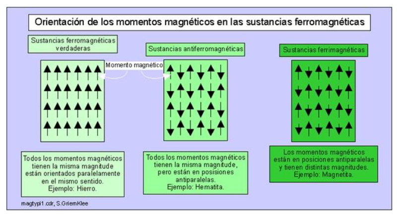

# Guia magnetismo

**1. El modelo actual, el Campo Magnético Terrestre (CMT) es generado en el núcleo terrestre, presentando variaciones temporales (tanto en intensidad como en dirección) y siendo la superposición de contribuciones magnéticas de distinto origen:**

* **Campo principal:** Generacion del campo magnetico dipolar debido al nucleo terrestre.
* **Campo cortical:** Campo magnetico generado por las rocas magnetizadas en la corteza.
* **Campo externo:** Campo magnetico generado en la ionosfera debido al viento solar y la induccion de corriente electrica en la litosfera desde el campo externo.

**2. En primer orden, el CMT puede aproximarse como el campo generado por un dipolo magnético ubicado en el centro de la Tierra, cuyo Momento dipolar Magnético apunta en dirección SE, desviado unos 11,5° del sur geográfico.**

* **¿Por qué es un dipolo?:** Porque puede ser aproximado como un iman con un polo norte y un polo sur, las lineas de campo magnetico terrestre salen del polo sur geografico y entran en el polo norte geografico.
* **¿Existe el monopolo? (Hint: vean las ecuaciones de Maxwell):** En la naturaleza no existe el monopolo pues las lineas de campo magnetico (segun las ecs de maxwell) son cerradas, el comportamiento no es equivalente a los monopolos electricos.
* **El Momento Dipolar Magnético (𝑚⃗⃗ ) se mide en 𝐴𝑚^2 y se refiere a la corriente que circula por una espira por el área de la misma, por lo que la ecuación es:** I*m^2

**El potencial V creado por un dipolo con un momento magnético 𝑚⃗⃗ en un punto a una distancia R de su centro es:**

* **¿Qué es 𝜇0?:** Es la permitividad magnetica en el vacio, posee un valor de 4*pi*10e-3 [NA^-2].
* **¿Cómo se relaciona V con el Campo Magnético 𝐵⃗?:** El campo magnetico resulta de aplicar el operador nabla al potencial, es decir B=nabla X V=rotor(V)

**3. Componentes del campo magnetico terrestre.**

* **Eje X:** Equivale al meridiano geográfico y apunta hacia el N
geográfico.
* **Eje Y:** Equivale a los paralelos geográficos, apunta al este
geográfico.
* **Eje Z:** Equivale a la vertical en el punto, siendo mayor a cero
hacia el interior de la Tierra.
* **Componente H:** Componente horizontal del campo, H = sqrt(X^2 + Y^2)
* **Componente F:** Campo total, F = sqrt(X^2 + Y^2 + Z^2)
* **Componente D:** Declinacion del campo, D = arctan(Y/X)
* **Componente I:** Inclinacion del campo, I = arctan(Z/X)

**4. ¿Cuándo la magnitud del campo es máxima y cuándo es mínima?**

La magnitud del campo magnetico es maxima en el ecuador y minima en los polos.En el cuado el campo magnetico es mas horizontal y tiene una intensidad mayor, en cambio en los polos es mas debil y su magnitud alcanza su valor minimo debido a que el campo se inclina hacia abajo.

**5. ¿Qué significa en términos de las líneas de campo, los valores I=-90, 90, 0?**

* **I=0:** Significa que la inclinacion es de 0 grados, esto ocurre cerca del ecuado donde el campo es paralelo a la superficie.
* **I=90:** Inclinacion de 90 grados, lo cual ocurre en el polo Norte geografico.
* **I=-90** Inclinacion de -90 grados, ocurre en el polo Sur geografico, aca salen las lineas de campo.

**6. La magnetización de un mineral es proporcional a la intensidad horizontal del campo
inductor y a la susceptibilidad magnética.**

* **Defina susceptibilidad magnetica:** Es la capacidad que posee un material a magnetizarse en presencia de un campo magnetico.
* **Materiales con susceptibilidad magnetica pequenha y negativa:** Se le denominan materiales diamagneticos, ej: sal, calcita.
* **Materiales con susceptibilidad magnetica pequenha y positiva:** Se le denominan materiales paramagneticos, ej: olivina, clorita, piroxeno.
* **Materiales con susceptibilidad magnetica grande y positiva/negativa:** Se le denominan materiales ferromagneticos, ej: minerales metalicos como magnetita.

* **Temperatura de Curie:** temperatura por encima de la cual un cuerpo ferromagnético pierde su magnetismo comportándose como un cuerpo paramagnético.

**7. ¿Qué es la Magnetización Remanente y Magnetización inducida?**

* **Magnetizacion remanente:** Es la parte permanente de la magnetizacion de una roca y es independiente del campo magnetico externo. Fue adquirido en algun momento del pasado geologico, pero puede resetearse si pasa sobre la temperatura de curie.
* **Magnetizacion Inducida:** El magnetismo inducido es aquel magnetismo generado por un cuerpo, debido a la existencia de un campo magnetico externo. Dependiente de la suceptibilidad magnetica.
