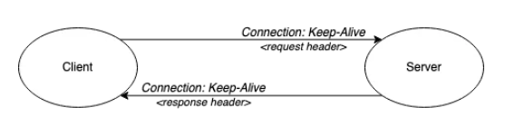
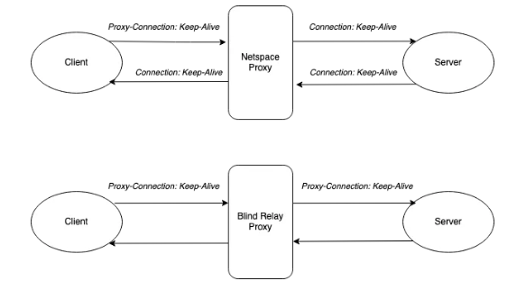
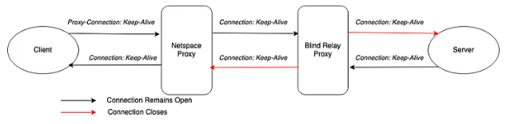
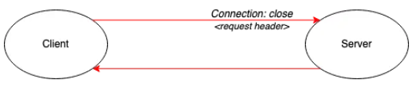

# Proxies y Conexiones Persistentes

## Conceptos

* **Proxy:** Servidor intermediario entre un cliente y un servidore. El proxy toma los request de un cliente, puede que evalue la peticion, y luego la redirige hacia el servidor de donde obtiene una respuesta, y finalmente envia esta respuesta al cliente.
* **Keep-Alive:** Valor para header `Connection` el cual indica que la conexion entre cliente y servidor debe ser persistente. Es decir, no debe cerrarse el canal de comunicacion una vez llegada la respuesta del servidor al cliente.

## P1. Proxies y Keep-Alive

**En HTTP 1.0, luego de terminado el intercambio entre dos entidades, el canal se cerraba, por lo que cada conexion debia ser restablecida para poder hacer una nueva solicitud. en orientado a conexion, esto resulta muy costoso. Para solucionar este poroblema, HTTP 1.0 comenzo a reutilizar canales de conexion, indicado por el header `Connection: Keep-Alive`.**

**Si el servidor no soporta conexiones Keep-Alive, simplemente no manda el header `Connection` en la respuesta y cierra la conexion. Sin el header, el cliente sabe que ese canal no va a ser reutilizado en caso de querer hablar de nuevo, sino que debe establecer uno nuevo. Hasta aqui todo bien, pero, que ocurre si se agreaga un proxy que simplemente redirige los mensajes que le llegan? Existira algun problema?**

Este tipo de proxies que simplemente redirigen los mensaje de un cliente a un servidor, no leen el contenido de lo que reciben, simplemente lo envian, incluido el header `Connection`. Luego, el servidor ve que le llega una request con el header `Connection` con valor Keep-Alive, a lo que responde tambien con el mismo header y valor, y mantiene la conexion entre si mismo y el proxy abierta.

Luego, el proxy reenvia esa respuesta del servidor al cliente, este reciviendo la confirmacion de mantener la conexion abierta, por lo que tambien lo hace, pero con el proxy. En este momento, tanto cliente como servidor estan manteniendo un  canal de comunicacion abierto con el proxy.

El proxy no soporta Keep-Alive, simplemente reenvia paquetes HTTP, por lo que ahora cierra ambas conexiones al ver que la request ya fue resuelta. Acto seguido, descarta losmensajes por parte del cliente, ya que no hay canal establecido, a pesar de que el cliente cree que si. Y el servidor queda con el socket ocupado, esperando nuevas requests por parte del proxy, las cuales nunca llegan.

Ante lo anterior, se creo una solucion. Esta consiste en un nuevo header, `Proxy-Connectiond`. Luego, si el proxy es capaz de mantener la conexion abierta, elimina ese header y anhade un nuevo header `Connection` al paquete antes de reenviarlo al servidor. Si el proxy no sabe manejarlo, simplemente reenviara este header, el cual va a ser ignorado por el servidor y no respondera con el header `Connection: Keep-Alive`, cerrando asi la conexion y evitando el problema. El siguiente diagrama lo ilustra.

Aun asi, este modelo se cae en caso de existir un proxy que solo reenvia mensajes, ademas del proxy que si maneja conexiones persistentes.

Finalmente, en HTTP/1.1 se disenho para siempre trabajar con conexiones persistentes, a menos que se especifique lo contrario. Tambien se utiliza el header `Connection`, pero solo con el valor `close`, el cual indica cuando se debe cerrar la conexion.

**OBS: Mas info en [aca](https://www.oreilly.com/library/view/http-the-definitive/1565925092/ch04s05.html).**

## P2. Bytes

**Los headers en HTTP se encuentran codificados en texto plano, sin embargo, muchos otros protocolos de comunicacion prefieren usar directamente bytes, Por que sera esto, Cual es su utilidad practica?**

Durante la auxiliar se mostro un pequenho codigo en el que se ejemplifico como utilizar bytes para guardar la informacion de los headers. Esto resulta en una mejor utilizacion de los recursos, reduciendo el tamanho de lo que se quiere enviar.
