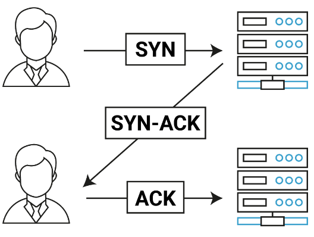
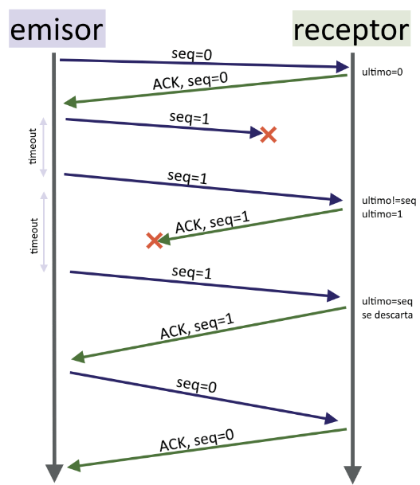

# Capa de Transporte

## P1. Verdadero o Falso

**1. La capa de transporte se encarga de enviar informacion a traves de la red, considerando que en el camino se encuentra con routers (no es punto a punto).** *R: Falso. La capa de transporte se encarga de enviar informacion punto a punto entre procesos. Para lo anterior, utiliza direcciones (IP, Puerto).*

**2. Los protocolos mas utilizados en la capa de transporte son TCP y UDP.** *R: Verdadero. TCP es un protocolo de comunicacion orientado a conexion y confiable utilizado para la transmision de datos a traves de redes. Se encarga de establecer un canal de comunicacion, asegurarse de que los paquetes lleguen a su destino sin errores, retransmitir los paquetes perdidos y controlar el flujo de datos entre los dispositivos. UDP es un protocolo de comunicacion no orientado a conexion. A diferencia de TCP, no se establece una conexion entre los dispositivos antes de enviar los datos y no hay garantia de que los paquetes de datos lleguen a su destino o lleguen en orden, pero a la vez permite mayor velocidad en la transmision.*

**3. El handshake en TCP tiene 3 pasos por convencion, pero no hay problemas en hacer un problemas en hacer un handshake en 2 pasos.** *R: Falso. Se debe utilizar tres manitas para establecer comunicacion bidireccional.*

**4. Stop & Wait espera a que un segmento llegue bien antes de enviar el siguiente. Esto lo hace poco eficiente, pues no necesariamente aprovecha la capacidad del canal.** *R: Verdadero. En Stop & Wait el emisor espera un mensaje de confirmacion ACK de parte del receptor, para verificar que el paquete llego a destino, antes de enviar el siguiente paquete. Mientras se espera por los ACKs, que no siempre llegan, el canal queda sin utilizar, no aprovechando al maximo los recursos disponibles.*

**5. No es posible que el emisor reenvie un segmento que llego con exito al emisor.** *R: Falso. Si se pierde el ACK del receptor, el emisor va a creer que no llego el segmento, por lo que lo va a reenviar, pero el receptor se dara cuenta y desechara el mensaje.*

**6. Si usted configura su timeout tal que este es mas corto que el tiempo necesario para que un segmento llegue a su destino y vuelva su confirmacion (ACK), Cuales de las siguientes alternativas se cumple?:**

* **El receptor recibe y guarda un mismo segmento 2 o mas veces** *R: Falso. No lo va a guardar 2 veces, gracias al numero de secuencia.*
* **El emisor envia un mismo segmento 2 o mas veces.** *R: Verdadero. Al no llegarle el ACK, va a reenviar.*
* **El emisor queda en un loop infinito enviando un mismo segmento, pues la confirmacion nunca llega.** *R: Falso. Los ACKs van a llegar, tarde, pero llegan.*

## P2. Conexiones orientadas a conexion

**Explique como se establece la conexion usando 3-way handshake, Como puede alguien aprovecharse de este proceso para perjudicar servidores?**

Como se reservan recursos antes de establecer la conexion se puede hacer un **SYN FLOOD (DoS)**, este tipo de vulnerabilidad ya se encuentra parchada.

## P3. Timeouts

**1. En el diagrama del 3-way handshake visto en el video de "TCP, UDP, Stop & Wait" no se muestra uso de timeoyuts, Que problemas puede traer esto? Como se puede solucionar?**

Luego de enviar un paquete SYN, podria darse el caso que este no llegue y el cliente se quede esperando un SYN-ACK para siempre, que nunca le llegara.

**2. Buscando en Internet usted descubre que existe un tipo de mensaje llamado NACK o Negative Acknowledge el cual sirve para indicar que algo no llego de forma correcta, Que modificaciones tendria que hacer en el 3-way handshake para que utilice exclusivamente NACKs? Considere el manejo de timeouts.**

La idea es eliminar los ACKs para confirmar la recepcion, y solo enviar un NACK despues de que se cumpla un timeout, por lo que se asume que el mensaje se perdio.

## P4. Numeros de Secuencia

**1. En Stop & Wait usamos numeros de secuencia para evitar duplicaciones. Si se pudiera garantizar un tiempo de ida y vuelta RTT bajo (tiempo en que llegue el mensaje de origen a destino + tiempo en que llegue el ACK de vuelta) tal que el timeout es mayor a ese tiempo (timeout RTT), Se podria eliminar el uso de numeros de secuencia en el envio de datos? Y en los ACKs? Explique por que ninguno de los casos se puede lograr sin perder confiabilidad en la comunicacion.**

Incluso si el RTT es menor que el timeout, todavia es posible que ocurran duplicados debido a la congestion en la red o a otras condiciones impredecibles. Por lo tanto, la eliminacion de los numeros de secuencia podria hacer que la comunicacion sea susceptible a errores y duplicados, lo que afectaria a la confiabilidad de la transmision. Los numeros de secuencia en los ACKs son esenciales para que el emisor sepa cuales paquetes han sido recibidos correctamente y cuales no. Sin estos numeros de secuencia, el emisor no puede saber con certeza si un paquete ha sido recibido correctamente o si se ha perdido.

**2. En la actividad sockets orientados a conexion con Stop & Wait el numero de secuencia inicial se escoge con un numero aleatorio entre 0 y 100, Que ventaja tiene usar un numero aleatorio versus siempre partir de 0, Que desventajas tiene que en la actividad el numero este acotado entre 0 y 100?**

Porque son numeros aleatorios podemos evitar que un agente malicioso se haga pasar por alguno de los entes en la comunicacion. La desventaja de que sea de 0 a 100 es que por temas de seguridad quereos que sea lo mas aleatorio posible y 0 a 100 no es ni tan aleatorio tampoco, 100 intentos y le achuntaste.

**3. En el caso de Stop & Wait visto en clases, tenemos que los numeros de secuencia incrementan de acuerdo al tamanho del area de datos recibidos en el lado del receptor, sin embargo, un estudiante que ya paso el ramo de redes le dice que es posible usar una cantidad acotada de numeros de secuencia los cuales pueden ir alternandose. Considerando el flujo de envio de Stop & Wait, Cual es la menor cantidad de numeros de secuencia que se necesitan para que Stop & Wait funcione?**

2, basta con 0 y 1, los cuales se pueden ir alternando entre mensajes. Achica los paquetes a enviar al soo requerir 1 bit para guardarlo.

## P5. Montemos un servidor de contenido

**Se le pide instalar un servidor de contenido al cual los clientes pueden solicitar descargas de diversos archivos. Los clientes, al momento de realizar las peticiones, deben especificar que tipo de conexion desean usar (TCP o UDP), y el servidor tiene que saber como manejar los casos.**

**1. Como realizaria la implementacion?**

Existen dos posibilidades:

  * Se debe tener un socket TCP que reciba las peticiones iniciales. Luego, lee la request del cliente y dependiendo de lo que solicite, se le deriva a otro socket TCP o UDP y desde ahi se le envia el contenido. **Existe alguna problema con la solucion anterior? Como lo solucionaria?** El cliente tambien necesitaria los dos tipos de sockets en caso de solicitar UDP, uno para establecer la conexion y otro para recibir los datos.
  * Otra solucion es tener dos sockets, uno UDP y otro TCP, que reciba las peticiones, que esten en distintos puertos. Entocnes los clientes le preguntan al puerto correspondiente. El problema de esto es que los clientes deben saber los puertos a que hablarles, dandoles mas trabjao.

**2. En caso de que un cliente que solicito UDP se caiga durante el envio de datos desde el servidor. Como implementaria una solucion para detectarlo y asi el socket no quede tomado enviando paquetes sin sentido?**

Utilizando la solucion 1, se puede, cada cierta cantidad de paquetes, enviar a traves del socket TCP una confirmacion tipo "oye, sigues vivo?", y asi asegurar que la conexion sigue existiendo. En caso de no existir respuesta, aunque no es seguro que TCP muerto $\Rightarrow$ UDP muerto, se puede cerrar la conexion, ya que igual es bastante probable. Si se obtiene respuesta, el cliente podria verificar el estado de su socket UDP y responder segun eso.
