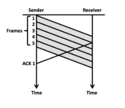

# Comunicandonos confiablemente

## Idea implementacion protocolos de Comunicacion Confiable

Para los siguientes protocolos, dibuje un diagrama de su funcionamiento y luego traspaselos a pseudocodigo:

* **Stop & Wait:**

```python
function send(msg):
    msg_len = len(msg)
    socket.send(msg_len)
    i=0
    while i < msg_len do
    msg_part = msg[i:i+16]
    socket.send(headers+msg_part, server)
    ack = socket.recv(headers_len)
    if valid_ack(ack) then i+=16

function recv(buff_size):
    internal_buff_size = 16
    if residuo = ’’ and bytes_por_recibir = 0 then
        bytes_to_recv = socket.recv(headers_len+internal_buff_size)
        bytes_por_recibir = bytes_to_recv
        self.seq += len(bytes_to_recv)
        message = recv_interno
    else
        if len(residuo) >= buff_size then
            to return = residuo[:buff_size]
            residuo = residuo[buff_size:]
            return to return
        else
            message = recv_interno
            message = residuo + message
    bytes_sobrantes = len(message) - buff_size
    if bytes_sobrantes > 0 then
    residuo = message[-bytes_sobrantes:]
    max_bytes = min(bytes_to_recv, buff_size)
    return message[:max_bytes]

function recv_interno(buff_size):
    message = ’’
    while len(message) < buff_size do
        received = socket.recv(headers_len+internal_buff_size)
        if valid_seq(received) then
            message += received
            self.seq += len(received)
            socket.send(ack)
            bytes_to_recv -= len(received)
            if bytes_to_recv <= 0 then
            break
        else
            if received < self.seq then
                socket.send(prev_ack) # prev ack correspondiente al seq que nos lleg ́o
return message
```

* **Go-Back-N:** (Codigo entregado por la profesora, se encuentra aca)
* **Selective Repeat:**

```python
function send(msg)
    msg_len = len(msg)
    data_list = [msg[i:i+16] for i in [0, msg_len] i+=16]
    data_list = msg_len + data_list
    data_window = SlidingWindow(data list)
    timer_list = TimerList
    for data in data_window do
        socket.send(data)
        timer_list[data.index].start
    acks_recv = []
    while true do
        timeouts = timer_list.get_timeouts
        if len(timeouts) > 0 then
            for timer in timeouts do
                socket.send(data_window[timer.index])
                timer.start
        recv = socket.recv()
        if valid_seq(recv[seq]) and recv[seq] not in acks_recv then
            acks_recv.append(recv[seq])
            timer_list.stop([recv[seq].index])
        pasitos = 0
        for seq in data_window.seqs do
            if seq not in acks_recv then
                break
            pasitos++
            acks_recv.remove(seq)
        data_window.move window(pasitos)
        if data_window.get data is None then
            return
        for data in data_window[pasitos:] do
            socket.send(data)
            timer_list[data.index].start

function recv(buff_size)
    """Importante, la idea es tambien implementar la parte de si quedan bytes de las llamadas anteriores, pero en honor al tiempo y el tamanho de la pauta, solo hare la parte de recibir con la ventana, ya que es lo mas fundamental que cambia."""

    recv_window = SlidingWindow(’’ for i in [0,window_size])
    msg_recv = socket.recv()
    len_to_recv = msg_recv[data]
    socket.send(ack)
    expected_acks = []
    msg=’’
    while true do
        msg_recv = socket.recv()
        for i in [0, window_size] do
            if recv_window[i][data] = ’’ then
                expected_acks.append(recv_window[i][seq])
            if msg_recv[seq] = recv_window[i][seq] then
                break
        if msg_recv[seq] in expected_acks then
            recv_window.put_data(msg_recv[data]) # Verificar posici ́on corresponda a seq
            for i in [0, window_size] do
                if recv_window[i][data] == ’’ then
                    break
                expected_acks.remove(msg_recv[seq])
                msg += recv_window.get_data
                recv_window.move_window(1)
        if len(msg) = len_to_recv then
            return msg
```

## Sliding Windows

Suponga que un emisor y un receptor estan usando Automatica Repeat Request para realizar una entrega confiable de datos.

**OBS: Es importante tener presente que el tamanho de venta es el numero de paquetes que un emisor puede enviar sin recibir un ACK.**

**1. En Go-Back-N, con tamanho de ventana 6, se han enviado los frames con numeros de secuencia del 1 al 5. El emisor acaba de recibir un ACK por el frame 1. Los frames del 6 al 10 esperan a ser enviados. Que frames puede el emisor enviar antes de tener que esperar el siguiente ACK del receptor?**

R: Si se dibuja lo que esta ocurriendo, es facil ver que en este punto, el emisor ha enviado los frames: 2, 3, 4 y 5 desde el ultimo ACK recibido. Como la ventana es de 6, podria enviar 2 frames mas, el 6 y 7.



**2. Algun tiempo despues, el emisor transmite los frames 20, 21, 22, 23, 24 y 26: pero el frame 22 se pierde. Si se usa Go-Back-N, que frame o frames tendria que retransmitir el emisor? Justifique.**

R: Con Go-Back-N **el receptor tiene solo un buffer** (osea, un tamanho de ventana de 1). Entonces el receptor enviara un ACK para el ultimo frame que fue recibido en secuencia, osea el 21 (ya que el 22 se perdio). El emisor tendra entonces que reenviar todos los paquetes despues de este.

**Responda a la misma situacion anterior pero ahora usando Selective-Repeat.**

R: Con Selective-Repeat el receptor tiene varios buffers y puede recibir frames fuera de secuencia. El receptor enviara un ACK por los frames 20, 21, 23, 24 y 26, pero no por el 22, porque se perdio. El emisor tendra que enviar solo el frame 22.
