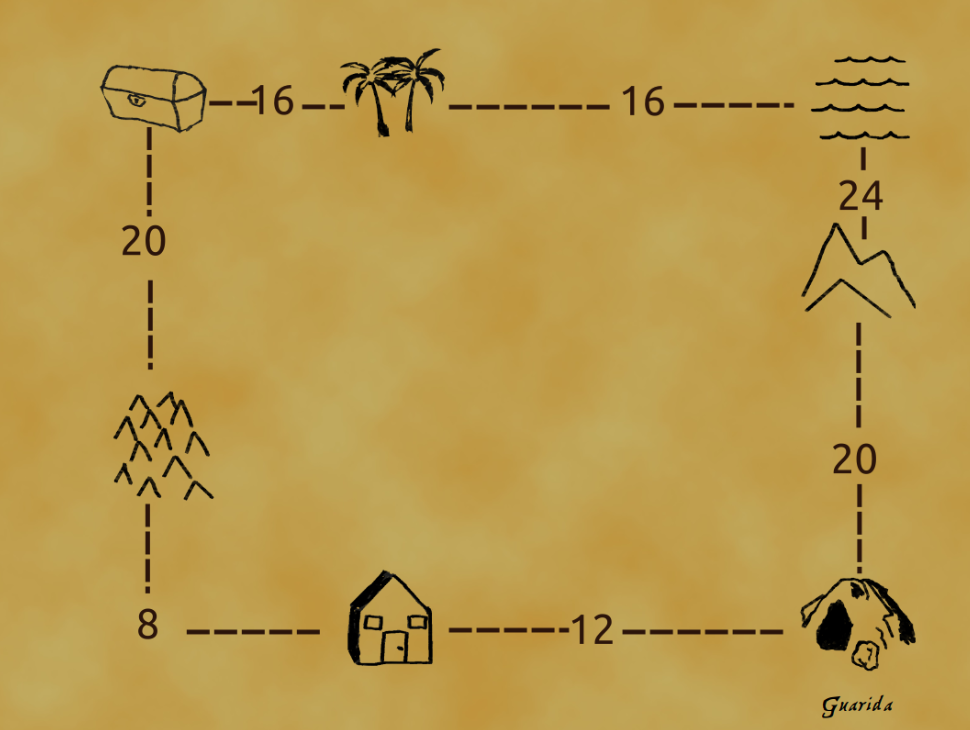

# Ruteando Rutas

## Verdadero o Falso

**1. Cuando un host solicita una direccion usando DHCP, este siempre sabe cual es la direccion del servidor DHCP, pues esta es una direccion reservada en la red local.**

R: Falso. El cliente no tiene idea de la direccion de la red, por lo que envia a la direccion de broadcast `(255.255.255.255, 67)`.

**2. Al enviar un `DHCPDISCOVER` el cliente, al no tener aun una direccion propia, usa como direccion de origen la direccion `0.0.0.0` para indicar que se encuentra en esta red (current network).**

R: Verdadero. Como no tiene direccion asignada todavia, simplemente utiliza la que corresponde a "esta red".

**3. Cuando se pierde un fragmento, el host se queda esperando a que llegue el fragmento perdido antes de re-ensamblar el datagrama.**

R: Falso. Al perderse un fragmento, como no se sabe donde se perdio ni que es, se descartan todo el datagrama.

**4. El campo FLAG del ultimo fragmento de un datagrama se setea en 1.**

R: Falso. El campo FLAG es 1 para todos los fragmentos, excepto el ultimo, que es 0.

**5. El MTU nos indica la maxima cantidad de informacion que el medio fisico seria capaz de transmitir.**

R: Verdadero. Significa Maximum Transfer Unit y es propiedad de cada una de las conexiones.

## Ruteo

**a) Dada la siguiente tabla:**

```txt
address/mask next hop
35.46.56.0/22 Interface 0
135.46.60.0/22 Interface 1
192.53.40.0/23 Router 1
default Router 2
```

**Hacia donde se van a dirigir paquetes cuyo destino sean las siguientes direcciones?**

* **135.46.36.10**
* **135.46.57.14**
* **192.53.40.7**
* **192.53.56.7**

R: Primero se tiene que ver los numeros en representacion binaria. Para la tabla:

* 135.46.36.10/22 = **10000111 00101110 001110**00 00000000
* 135.46.60.0/22 = **10000111 00101110 001111**00 00000000
* 192.53.40.0/23 = **11000000 00110101 0010100**0 00000000

Luego, para cada una de las consultas, se tiene que:

* 135.46.36.10 = 10000111 00101110 00100100 00001010 -> Router 2.
* 135.46.57.14 = 10000111 00101110 00111001 00001110 -> Interface 0.
* 192.53.40.7 = 11000000 00110101 00101000 00000111 -> Router 1.
* 192.53.56.7 = 11000000 00110101 00111000 00000111 -> Router 2.

**b) Una de las principales premisas de IPv6 es "un host, una IP". Bajo esta premisa y dado que los RIRS estan entregando segmentos IPv6/48, cree usted que se lograran erradicar las redes privadas como la de su casa? Justifique.**

R: Esto significa que tenemos 2^(48) direcciones posibles para entregar. Actualmente, hay 8x10^9 personas en el planeta. Con esto tenemos que existen aproximadamente 35.000 direcciones IPv6 por persona. Luego parece seguro asumir que hay suficientes direcciones para eliminar todas las redes privadas.

## Busqueda del tesoro

**Imagine que es parte de una tripulacion pirata y han encontrado un tesoro valioso en una isla remota. El tesoro esta compuesto por una coleccion de joyas y monedas de oro, los cuales en total tienen un peso de 144 bytes. El capitan necesita transportarlo a su guarida secreta, sin embargo, debido a las restricciones del transporte maritimo y para no levantar sospechas, solo se pueden transportar cofres segun un tamanho maximo dictado por cada ruta del siguiente mapa:**



**Por lo tanto, le pide ayuda a usted para planificar el transporte segun restricciones anteriores. Ademas, conociendo al capitan, sabe que es obsesivo, asi que debe asegurarse que el tesoro quede en el mismo orden en que fue encontrado. Utilizando las ensenhanzas entregadas a usted por su querida profesora Dr. Bachmann, genere un algoritmo que permita lo solicitado.**

**Tenga en cuenta las siguientes consideraciones:**

* En la guarida no tienen informacion del tesoro, por lo que debe armar los cofres de forma que ellos sepan como reensamblar el tesoro correctamente (y el capitan no se enoje D:).
* Utilice round-robin para evitar sospechas sobre la cantidad de barcos yendo por el mismo lugar.
* Hay una gran diferencia en la habilidad de navegacion entre la tripulacion, por lo que existe la posibilidad que ciertos cofres vayan mas lento.
* Asuma una cantidad infinita de barcos en cada parada, pero cada uno tiene un costo asociado por tramo, que debe intentar minimizar.
* A priori no sabe las restricciones de todas las rutas, solo las inmediatas de cada parada a la siguiente.
* Cuidado con que llegue un barco enemigo disfrazado a la guarida, con intenciones de ingresar contrabando (como bombas escondidas que se activan al contacto con el tesoro :0).

R: Se tienen varios aspectos a considerar, para lo cual utilizaremos etiquetas que nos garantizaran un correcto manejo de los cofrecitos. Estas seran de la siguiente forma (ejemplo primer paquete): `C, 0, 16, 1`, donde al inicio se indica un codigo secreto que solo su tripulacion conoce, luego el offset del tesoro contenido en este cofre, el tamanho del tesoro y finalmente un FLAG para identificar si es el ultimo cofre o no.

Luego, se crean 8 cofres a partir del inicial. 4 son de la forma `[C,36i,16,1] for i in [0,3]` que se enviaran por la ruta de la derecha, y los otros 4 son `[C,16+32i,20,1] for i in [0,3]`, excepto el ultimo que tendra FLAG=0, que iran por abajo.

Los cofres que van por la derecha no necesitaran volver a ser fragmentados en ninguna parada. Incluso, se podrian recombinar en alguna para aprovechar mejor los recursos, pero no se realizara debido a que no deben ponerse en ese caso para las actividades.

En cambio, los que se envian por abajo, se tendran que volver a dividir luego de la primera parada debido a que la ruta solo permite paquetitos de maximo 8 bytes. Estos tenian la forma `[C,16+36i,20,FLAG] for i in [0,3]`, por lo que cada uno se partira en 3 y quedara una lista de 12 paquetes de la siguiente forma:

* `[C,16,8,1]`
* `[C,24,8,1]`
* `[C,32,4,1]`
* `[C,52,8,1]`
* `[C,60,8,1]`
* `[C,68,4,1]`
* `[C,88,8,1]`
* `[C,96,8,1]`
* `[C,104,4,1]`
* `[C,124,8,1]`
* `[C,132,8,1]`
* `[C,140,4,0]`

Nuevamente, se podria ver de esperar otros y volver a unir para aprovechar el MTU de 12 de la ultima ruta, pero es complicarse mas de lo necesario.

A medida que lleguen los paquetes a la guarida, lo primero que se hara es verificar el sello. No es tan solo la letra C, ellos saben perfectamente a que refiere: *You know a pirate's favorite letter? Yoy'd think is the R but it's true love is the C.*. Luego, mientras no haya llegado el ultimo con FLAG=0, saben que no vale la pena intentar rearmar, ya que puede que falten trozos. Una vez llegue, se empieza a intentar a rearmar cada vez que llega un nuevo cofrecito, calculando que los tamanhos correspondan con los offsets de cada uno.

Finalmente, cuando lleguen todos, el rearmado en orden se vera de la siguiente forma:

1. `[C,0,16,1]`
2. `[C,16,8,1]`
3. `[C,24,8,1]`
4. `[C,32,4,1]`
5. `[C,36,16,1]`
6. `[C,52,8,1]`
7. `[C,60,8,1]`
8. `[C,68,4,1]`
9. `[C,72,16,1]`
10. `[C,88,8,1]`
11. `[C,96,8,1]`
12. `[C,104,4,1]`
13. `[C,108,16,1]`
14. `[C,124,8,1]`
15. `[C,132,8,1]`
16. `[C,140,4,0]`

Pregunta extra: ¿Como manejarian el caso de que existiese posible robo de las mercancias? ¿Se tendrian que preocupar o no?
