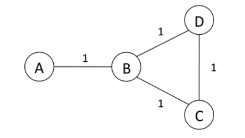

# IPs, NAT y Capa de Enlace

Conceptos relevantes que no se pasaron:

- **Access Points (AP):** Componente fisico que permite conectar dispositivos wifi a una red cableada. Por lo general, es parte de un router, aunque puede ser externo y conectarse a uno. Se encarga de transformar las senhales inalambricas a senhales por un cable.
- **Internet Service Provider (ISP):** Entidades que proveen servicios para acceder y navegar por internet.
- **Canal:** Define una banda de frecuencias especifica en las que se transmiten las senhales inalambricas.
- **Service Set Identifier (SSID):** Es un identificador que le da un nombre a una red wifi. Son los nombres que ven cuando buscan conectarse a una red en su celular o pc.
- **Media Access Control Address (MAC Address):** Sirve para identificar un dispositivo dentro de una red local. A diferencia de las IP, esta se utiliza en la capa de enlace de datos para enviar las senhales a traves de los componentes fisicos.

## Seguimos ruteando

1. Suponga que tiene la red mostrada en la imagen, que usa RIP como protocolo de ruteo, y considera que 16 es infinito. La notacion que usaremos es la siguiente: A(C, B, 2) indica que el nodo A tiene una ruta a C de costo 2 con B como next-hop.

- Si el enlace entre A y B falla, B de inmediato setea en su tabla B(A, -, inf). Den una secuencia de eventos en que ocura un count-to-infinity (suponga que los nodos no estan usando ninguna tecnica de prevencion de loops).

    **R:** Hay varias formas de generar un loop, aca un ejemplo:

  - B manda B(A, -, inf) a C y D. C manda C(A, B, 2).
  - D toma la informacion de C y decide que puede llegar a A a traves de C: D(A, C, 3) y anuncia eso mismo.
  - B decide que puede llegar a A a traves de D: B(A, D, 4) y anuncia eso.
  - C decide que puede llegar a A traves de B...

- Despues de ver los problemas, los disenhadores de la red deciden incluir Split Horizon para prevenir loops. Muestre que esta tecnica no ayuda en el loop anterior, Por que ocurre esto? Que tipos de loops si se puede prevenir Split Horizon?

    **R:** Split Horizon evita los loops de tamanho 2 solamente (pues evita que la informacion "contaminada" se propague un paso), asi que en el caso anterior no sirve, pues el loop recien aparece en el paso 2.

2. Youtube tiene prefijo `208.65.152.0/22`. En el 2008, Pakistan empezo a declarar rutas al prefijo `208.65.153.0/24`, lo que causo que muchos usuarios llegaran a los servers de pakistanies en lugar de los de Youtube.

    - Por que los routers preferian los anuncios paquistanies a los de Youtube?
    - Que fraccion de las direcciones de Youtube fueron secuestrados por el anuncio paquistani?
    - Si Youtube quisiera detener el ataque rapidamente, que prefijos tendria que anunciar?

    **R:**

    - Por que las direcciones declaradas por Pakistan son mas especificas que las de Youtube.
    - 1/4, porque ellos declaraban un prefijo /24, mientras que Youtube es /22 (Se puede calcular las direcciones que existen con el prefijo de todas maneras).
    - Tendria que anunciar, por separado, los prefijos que Pakistan se robo (y de forma mas particular): `208.65.153.0/25` y `208.65.153.128/25`.

## NAT

1. Los promotores de IPv6 argumentan que NAT ya no sera necesario y que era tremendamente danhino para Internet, al romper el principio de conectividad total. Los administradores de redes, en cambio, piensan que NAT aumenta la seguridad de sus redes y creen que debiera utilizarse tambien en IPv6. Quien tiene razon? Argumente tecnicamente.

    R: NAT se usa como firewall porque para que se establezca la conexion un host de la red privada tiene que iniciarla (usualmente al menos) y, por lo tanto, no pueden llegar paquetes que no se estaban esperando. Sin embargo, el objetivo real de NAT es tener suficientes direcciones IP, lo cual ya no es problema con IPv6. En cuanto a la seguridad, esto se puede arreglar en capa de aplicacion junto a firewalls. Por lo tanto, los promotores de IPv6 tienen razon.

2. Que dificultades existen al montar un servidor (Ej: un web server) detras de un router NAT?

    R: La solicitud para iniciar la comunicacion va a venir desde el cliente, es decir, del lado publico del NAT. Para forwardear correctamente el paquete, se debe utilizar la direccion IP publica, y es esta la que tendra el paquete, en vez de la privada del servidor. Pero cuando esto llegue al router NAT, no va a saber a cual de sus IPs privadas corresponde la solicitud.

3. supongamos queremos detectar el total de hosts detras de una NAT. Ustedes observan que la capa de red pone un numero de identificacion secuencial en cada paquete IP; el numero del primer paquete es aleatorio, mientras que aquellos de los paquetes siguientes son secuencial.

- Basado en estas observaciones, y asumiendo que pueden interceptar todos los paquetes que se mandan desde la NAT al mundo exterior, Como podrian detectar el numero de hosts detras de una NAT? Alguna limitacion que detecten en su tecnica?

    R: Si asumimos que todos los paquetes salen, puedo juntar todos los paquetes y revisar los numeros de secuencia, luego, puedo agrupar estos numeros en un cluster si son consecutivos. El numero de clusters es finalmente el numero de hosts. La tecnica esta limitada por un detalle: todos los paquetes tienen que salir (no hay mensajes directos entre los hosts detras de la NAT).

- Si los numeros de identificacion no se asignan secuencialmente (sino al azar), Funcionaria su idea?

    R: No, pues no tengo forma de agrupar numeros relacionados.

## Configurando puntos de acceso

Suponga que una cafeteria tiene dos APs (Access Points), cada uno operado por un ISP distinto y con su propio bloque de direcciones IP.

- Suponga que, por accidente, cada ISP configuro su AP para operar en el canal 11. Que ocure en este caso cuando los dos APs tratan de transmitir al mismo tiempo? Se rompe el protocolo?

    R: No, pero en general la calidad de la conexion sera mala, pues habra muchas colisiones. Lo que ocurre en este caso es que los clientes se asocian con un AP a traves del SSID y la MAC address del AP, por lo que no hay confusion y para cada cliente solo un AP importa. Lo que si, al tratar de transmitir por el canal, puede que escuche que este esta ocupado mucho rato, por lo que tardara en transmitir. (Esto conceptos no se pasaron, pero es bueno saberlo).

- Suponga que uno de los APs opera en el canal 1 y el otro en el 11. Como se cambian sus respuestas?

    R: Ahora no hay colision y los clientes de ambos APs seran felices.
