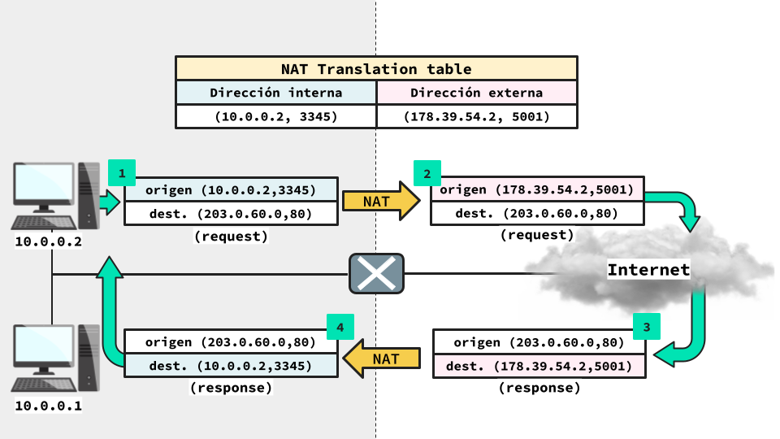

# El parche de IPv4: Redes privadas

- [El parche de IPv4: Redes privadas](#el-parche-de-ipv4-redes-privadas)
  - [Contexto IPv4 e IPv6](#contexto-ipv4-e-ipv6)
  - [Redes privadas](#redes-privadas)
  - [Network Address Translation (NAT)](#network-address-translation-nat)
  - [NAT translation table](#nat-translation-table)
  - [Tipos de NAT](#tipos-de-nat)
  - [Ventajas de NAT](#ventajas-de-nat)
  - [Desventajas de NAT](#desventajas-de-nat)

## Contexto IPv4 e IPv6

En la unidad de IP discutimos la existencia de IPv4 e IPv6. Alli vimos que, dado el incremento acelerado en el numero de hosts conectados a Internet, las direcciones IPv4 se iban a acabar. Para combatir la escasez de direcciones se creo IPv6 el cual tiene muchas mas direcciones posibles que IPv4. Sin embargo, desarrolllar un nuevo protocolo toma tiempo, por lo que se decidio parchar IPv4. Este parche fue tan exitoso que aun hoy se siguen usando direcciones IPv4, y aun no se hace una transicion completa a IPv6.

Pero, en que consistio este parche a IPv4?

Para evitar que las direcciones IPv4 se acabasen antes de que IPv6 estuviese terminado, se creo el concepto de **Redes Privadas**.

## Redes privadas

Las redes privadas, como su nombre lo sugiere, son redes tales que las **direcciones que contienen son privadas** y no publicas. Es decir, las direcciones contenidas dentro de la red **son conocidas unicamente dentro de la red**. Fuera de la red privadas, estas direcciones no son conocidas. Este sistema permite que dos redes privadas distintas contengan las mismas direcciones, o sea, podemos repetir direcciones sin que esto sea un problema para el funcionamiento de Internet.

**En IPv4, las redes privadas usan espacios de direcciones asignados especialmente para redes privadas: `10.0.0.1/8`, `172.16.0.0/12` y `168.0.0/16`**. Las direcciones contenidas en estos espacios son consideradas **direcciones reservadas** y no pueden ser usadas en Internet. Sin embargo, **las mismas direcciones privadas pueden ser utilizadas en multiples redes privadas.**

El poder repetir direcciones le permitio a IPv4 seguir funcionando a pesar del continuo incremento en el numero de hosts o equipos solicitando direcciones IPv4, pues usando redes privadas es posible repetir un mismo conjunto de direciones tantas veces como sea necesario sin afectar el funcionamiento de Internet como tal, permitiendo suplir a los hosts de direcciones sin que estas se agoten.

Esta solucion suena bastante buena. Tan buena que nos podriamos cuestionar la necesidad de IPv6. Sin embargo, esta solucion no es *directa*. Sabemos que un host necesita de una direccion unica para poder conectarse a Internet. En particular, sabemos que **para mandar paquetes IP a un host, necesitamos saber la direccion de este**. En el caso de las redes privadas, al contener direcciones que no son publicas, **si un host fuera de la red privada quiere comunicarse con un host dentro de ella entones este no tiene forma de saber la direccion de destino.** La direccion privada no solo no es conocida desde afuera, si no que existen muchos otros hosts en otras redes privadas que pueden compartir la misma direccion.

Para resolver este problema se creo la tecnica de **Network Address Translation (NAT)**.

## Network Address Translation (NAT)

Si bien **NAT** ha sido ampliamente utilizado para usar direcciones IPv4 de manera eficiente, *NAT puede ser utilizado para otros propositos*. En esta seccion nos enfocaremos en el uso de NAT como parche de IPv4.

*La traduccion de direcciones de red* o NAT por sus siglas en ingles hace referencia al proceso que le permite a una direccion publica unica representar a un grupo de direcciones privadas.

Desde fuera de la red privada, todos los datagramas que provienen desde dentro de la red privada tienen la misma direccion la cual corresponde a la direccion publica que representa a la red. Esto significa que si dos equipos distintos, **con direcciones privadas distintas**, se comunican con hosts en el exterior, entonces sus datagramas tendran la misma direccion de origen. Luego, cuando los hosts externos envien sus respuestas, estan iran **dirigidas a la misma direccion IP**. De esta forma, para que una direccion publica pueda representar a una red privada, se debe contar con **un equipo que tenga una IP publica** (para representar a la red) tal que sea **capaz de traducir direcciones publicas privadas y viceversa**. Para ello se va a utilizar un **router con NAT** o **router NAT**.

**Un router NAT procesa todo datagrama que entra y sale de la red**. Cada vez que procesa un mensaje, el **router NAT** debe traducir la direccion publica a la direccion privada segun corresponda. Cuando un **datagrama entra a la red**, el **router NAT** cambiara la direccion publica de destino del datagrama, por la direccion privada que tiene el host de destino dentro de la red. Mientra que cuando un **datagrama sale de la red**, el router NAT cambiara la direccion privada de origen por la direccion publica que representa a la red. Para saber que datagrama va a que host dentro de la red privada, el router NAT utiliza una **NAT translation table.**

## NAT translation table

La **NAT translation table** es la tabla que utilizan los routers NAT para **identificar que datagramas provienen o van dirigidos desde un cierto host dentro de la red privada**. Dentro de esta tabla, cada host dentro de la red privada es asociado a un numero de puerto en particular. Luego, cuando un datagrama cuyo destino esta fuera de la red pasa por un router NAT, este **cambia la direccion privada por la direccion publica, y cambia el puerto de origen por el puerto asignado a dicho host.** Asi, cuando llegue el mensaje de respuesta, el router NAT podra identificar a que host va dirigido dicho mensaje mirando el numero de puerto.

Es importante notar que este proceso de traduccion se inicia cuando un mensaje **desde el interior de la red privada es enviado a traves del router NAT hacia el exterior de la red**. Esto quiere decir que un host en el exterior de la red **no podra comunicarse con un host en el interior si es que el host interno no ha iniciado la comunicacion.**

## Tipos de NAT

El tipo de NAT que hemos visto hasta aqui corresponde a la version de NAT que nos **permite usar de forma eficiente las direcciones IP**. Este tipo de NAT es conocido como **Overloaded NAT** o **NAT con traduccion de puerto**. Veamos algunos tipos de NAT.

- **NAT bidireccional:** Este tipo de traduccion de direcciones permite que un **host externo** a la red privada **pueda iniciar comunicacion** con un **host interno**. Para poder lograr esto es necesario asociar una direccion publica a la direccion privada del host a traves de un servidor IP con IP publica o usando DNS para asociar un nombre al router NAT correspondiente.
- **Overlapping NAT:** Este tipo de NAT es utilizado para comunicar hosts que tengan **direcciones que se superpongan** o que tengan *overlap*. Una situacion donde esto puede ocurrir, corresponde al comunicar dos **hosts que pertenecen a distintas redes privadas y que utilizan la misma direccion.**

## Ventajas de NAT

Algunas de las ventajas de implementar NAT son:

- Uso eficiente del espacio de direcciones publicas disponibles en IPv4.
- Mayor control local y seguridad al anhadir un grado de indireccion entre la red privada y el resto de Internet.

## Desventajas de NAT

Algunas de las desventajas de NAT son:

- Se interpone entre los hosts y, por lo tanto, rompe el **end-to-end argument** de IP.
- **Rompe el encapsulamiento de capas**. Para funcionar, NAT no solo cambia las direcciones IP (*capa de red*), si no que tambien cambia los puertos (*capa de transporte*).
