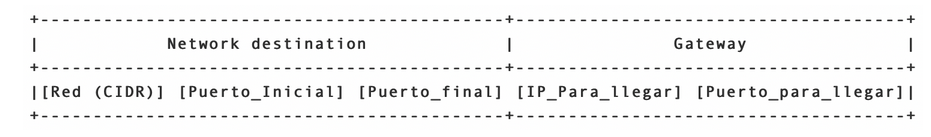

# Simulando un mini-internet

En esta actividad vamos a simular nuestro propio mini-Internet a nivel de la capa de red. Como vimos en los vides, en esta capa tenemos routers, tablas de ruta, y el Internet Protocol (IP) con sus propios headers. A continuacion veremos como vamos a simular nuestro mini-Internet.

## Routers

Para simular los routers usaremos sockets UDP. La capa de red se encuentra debajo de la capa de transporte y por lo tanto no tiene protoclos de transporte confiable como TCP. Para nuestro mini-Internet, cada router se simulara usando un socket asociado a un par (IP, puerto) especifico. Cada router debera contener una tabla de rutas para consultar hacia donde debe re-dirigir (o forwardear) los mensajes que reciba. En caso de que el mensaje tenga como destino el mismo router que lo recibio, dicho router debe imprimir el mensaje en pantalla, omitiendo headers.

En nuestro mini-Internet simularemos una red de forma local sobre una unica IP por propositos pedagogicos, por lo que para representar rangos de IPs utilizaremos rangos de puertos. Sin embargo, en la vida real, las redes se componen de varias direcciones IP y los puertos son utilizados para distinguir procesos.

## Headers

Similar a las actividades de TCP simplificado, usaremos nuestra propia estructura de headers. Esto facilitara un poco las cosas pues acceder a los headers IP de los sockets requiere permisos de administrados y/o conocimiento extenso de bajo nivel. Para esta actividad usaremos la siguiente estructura para nuestros paquetes IP:

```bash
[Direccion IP],[Puerto],[mensaje]
```

Donde la `[Direccion IP]` y el `[Puerto]` corresponden al par (IP, puerto) en el cual se encuentra escuchando el router de destino del `[mensaje]` (recuerde que su router se simula con un socket UDP asociado al par (IP, puerto)). De esta forma si, por ejemplo, tenemos el router R1 asociado a (127.0.0.1, 8881) y le enviamos el paquete `127.0.0.1, 8881, hola` usando netcat de la siguiente forma:

```bash
$ nc -u 127.0.0.1 8881 << EOF
127.0.0.1,8881,hola
EOF
```

**OBS:** Donde con `<< EOF` le indicamos al comando que debe terminar cuando ingresemos `EOF`, esto es estandar de bash.

Vamos a ver que R1 imprime en pantalla `"hola"`, pues ve que llega un mensaje cuyo destino se corresponde con su propia direccion. Si en cambio le enviamos el mensaje `127.0.0.1,8882,hola` nuestro router R1 va a ver que el mensaje no esta dirigido hacia el, sino que al router asociado a (127.0.0.1,8882), por lo que debera consultar su tabla de rutas para hacer forward y enviarlo por la ruta que corresponda.

## Tabla de rutas

Cada router o nodo de nuestro mini-Internet debe tener su propia tabla de rutas. Esta tabla de rutas debe indicar el camino por el cual se deber forwardear los mensajes en caso de ser necesario. En nuestra simulacion la tabla de rutas correspondera a un archivo `.txt` asociado al router. Este archivo contendra lineas indicando cual es el siguiente router al que se le debe enviar el mensaje para que llegue a su destino final. Cada linea tendra la siguiente nomenclatura:



Esta linea se traduce como: "Todo lo que reciba en el rango de direccion IP `[Red (CIDR)]`" y el rango de puertos `([Puerto_Inicial], [Puerto_final])` debo enviarlo al par `([IP_Para_llegar], [Puerto_para_llegar])`". El area de **Network Destination** es la red de destino y el area de **Gateway** corresponde al siguiente salto para llegar a la red de destino. En nuestro mini-Internet el rango de direccion IP [Red (CIDR)] corresponde a una unica direccion: 127.0.0.1 o localhost, pues estamos simulando una red (que normalmente contendria varias IP) usando varios puertos en vez de IPs.

Notemos que el `[Puerto_Inicial]` y el `[Puerto_final]` no son el origen y destino, sino la forma que tenemos de agrupar los hosts de la red que pertenecen a la misma IP pero que estan escuchando en distintos puertos.

**OBS: No olvide que aqui estamos simulando una red de forma local sobre una unica IP por propositos pedagogicos. Esta es la razon para utilizar un rango de puertos en vez de un rango de direcciones IP. Sin embargo, en la vida real, las redes se componen de varias direccion IP y los puertos son utilizados para distinguir procesos.**

## Ejemplos

### Ejemplo 1

Supongamos que nuestro mini-Internet contiene solo 2 routers conectados entre si: R1 asociado a `(127.0.0.1, 8881)` y R2 asociado a `(127.0.0.1, 8882)` como se muestra:

```
R1 <------> R2
```

Si a R1 le llega el paquete `"127.0.0.1,8882,hola R2!"` este vera que dicho mensaje no esta dirigido a el (R1). Luego, dado que el mensaje no es para el, R1 va a mirar su tabla de rutas para saber por donde *forwardear* dicho mensaje. En este caso la tabla de rutas de R1 se vera como:

```txt
# archivo rutas_R1_v1.txt

127.0.0.1 8882 8882 127.0.0.1 8882
```

Donde la linea `127.0.0.1 8882 8882 127.0.0.1 8882` indica que si recibo un mensaje que se dirige a la IP `127.0.0.1` con un puerto en el rango `(8882,8882)`, entonces debe reenviarlo o hacer *forward* hacia la direccion `(127.0.0.1, 8882)`.

Dado que nuestro Internet solo contiene a R1 y R2 conectados entre si, la tabla de rutas de R2 se vera como:

```txt
# archivo rutas_R2_v1.txt

127.0.0.1 8881 8881 127.0.0.1 8881
```

De esta forma si ejecutamos:

```bash
$ nc -u 127.0.0.1 8881 << EOF
127.0.0.1,8882,hola R2!
EOF
```

El router R1 va a ver que el paquete no es para el, asi que va amirar su tabla de rutas y ver que el paquete debe ir hacia R2. Una vez R2 reciba el paquete va a ver que este si es para el (R2) por lo que va a imprimir el contenido del mensaje en pantalla (sin headers), o sea , R2 va a imprimir `hola R2!`.

### Ejemplo 2

Suponga que ahora nuestro mini-Internet contiene solo 3 routers conectados entre si: R1 asociado a `(127.0.0.1,8881)`, R2 asociado a `(127.0.0.1,8882)` y R3 asociado a `(127.0.0.1,8883)` como se muestra:

```bash
R1 <------> R2 <------> R3
```

Agregar un nuevo router significa que todas las tablas de ruta cambian. Por ejemplo, en este caso la tabla de rutas de R1 va a ser:

```txt
# archivo rutas_R1_v2.txt

127.0.0.1 8882 8883 127.0.0.1 8882
```

Lo que se traduce a: "Para llegar a una direccion con IP `127.0.0.0/24` y puerto en el rango `(8882, 8883)` debo hacer *forward* hacia `(127.0.0.1,8882)`". Equivalentemente esto lo podemos interpretar como "si algo llega a R1 y va dirigido a R2 o R3, entonces debemos hacer forward por R2".

La tabla de rutas de R3 seria:

```txt
# archivo rutas_R3_v2.txt

127.0.0.1 8881 8882 127.0.0.1 8882
```

Es decir que "para llegar a R1 y R2, debo reenviar todo por R2".

Finalmente la tabla de rutas de R2 seria:

```txt
# archivo rutas_R2_v2.txt

127.0.0.1 8881 8881 127.0.0.1 8881
127.0.0.1 8883 8883 127.0.0.1 8883
```

Notemos que en este caso tenemos dos lineas en la *tabla de rutas*. Estas se deben chequear en **orden descendente**. Si el Network destination de la primera fila no contiene el par IP y puerto de destino, entonces paso a la siguiente linea. Este proceso se repite hasta encontrar una ruta para enviar el paquete o quedarse sin mas rutas posibles. En caso de que el destino del paquete no coincida con ninguna linea de la tabla de rutas, este es descartado.
